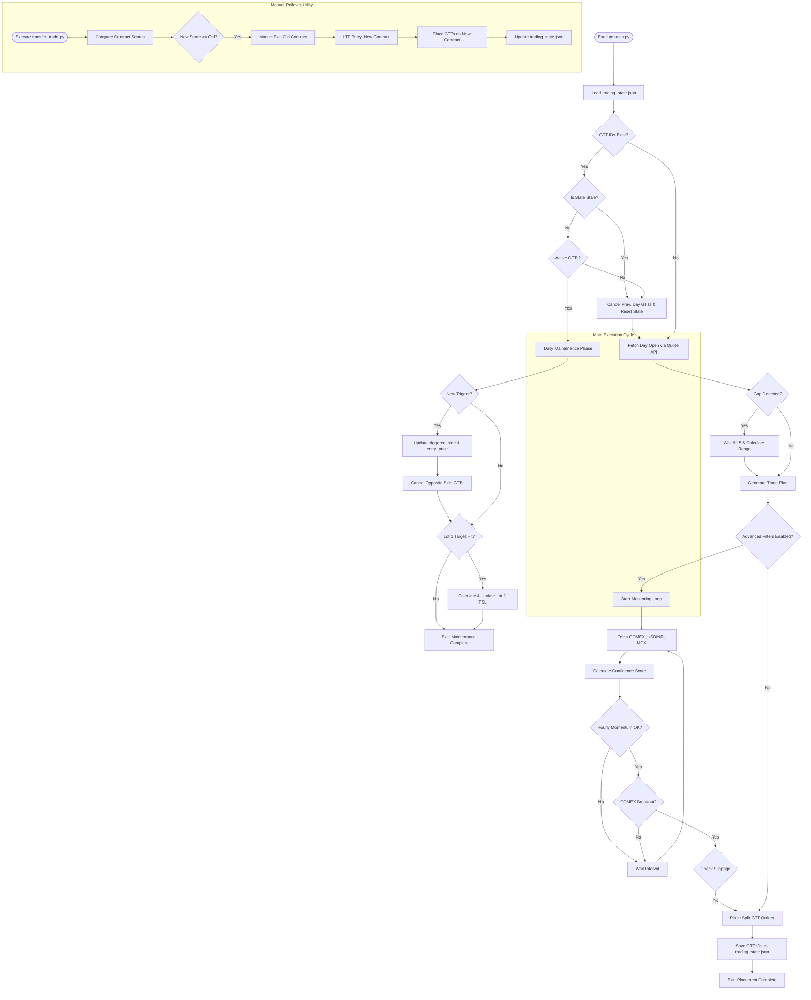

# Gold Trading System Flowchart

This document outlines the execution flow of the integrated Gold Trading Bot, including Advanced Monitoring and Rollover capabilities.

## Phase Descriptions

### 1. Maintenance Phase (Startup/Monitoring)
Performed every time the script runs if existing GTT orders are found.
- **Stale Cleanup**: Checks if orders are from a previous day. If valid/active, they are kept; otherwise, cleaned up.
- **Trigger Detection**: Checks if the market hit our entry levels.
- **Cross-Cancellation**: Cancels the opposite side (Buy/Sell) if a trade is triggered.
- **Trailing SL**: If **Lot 1 Target** is hit, moves the Stop Loss for **Lot 2** using technical levels.

### 2. Analysis & Placement Phase
Performed if no active orders exist.
- **Quote-Based Open**: Fetches reliable open price.
- **Gap Handling**: 
    - **Gap Up**: Open > Previous Day Close.
    - **Gap Down**: Open < Previous Day Close.
    - If Gap detected, waits for 09:15 range breakout.
- **Advanced Gatekeeper**: 
    - **Comex Filter**: Checks International Gold Trend.
    - **Confidence Score**: Combines USDINR, COMEX, and Technicals.
    - **Momentum Check**: Validates MCX Hourly Candles and Volume/OI.
- **Split Entry**: Places OCO (Lot 1) and Single (Lot 2) GTTs.

### 3. Rollover Utility (Manual)
Run `transfer_trade.py` when expiry is near.
- **Score Analysis**: Compares Volume/OI of Current vs. Next contract.
- **Execution**: 
    - Closes old position (Market).
    - Opens new position (Market/LTP GTT).
    - **Dynamic Sizing**: Transfers only remaining lots (e.g., if Lot 1 exited, only transfers Lot 2).
